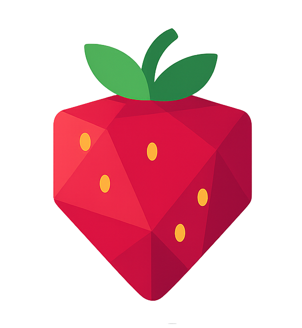

<div align="center">
  
  <h1>Strawberry Jam</h1>
  <a href='https://discord.gg/a2y6bZnhB3'>
    
  </a>
</div>

<br />

<div align="center">
A tool for exploring and extending <a href="https://classic.animaljam.com">Animal Jam Classic</a>!
<br /><br /></div>

## 🍓 What's Different from the Original Jam?

Strawberry Jam is a fork of the original [Jam](https://github.com/Sxip/jam) project, with new features, plugins, and improvements not found in the original.

## 🚀 Quick Start

###  Windows
1.  Download `Strawberry-Jam-Setup.exe` from our [latest release](https://github.com/glvckoma/strawberry-jam/releases/latest)
2.  Run the installer
3.  Launch Strawberry Jam from your Start menu

## ✨ Features

*   **🔍 Network Analysis:** Watch messages between your game and AJ's servers
*   **🔌 Plugin System:** Add cool new features with plugins
*   **🖥️ Easy to Use:** Simple desktop app with everything you need

## ⚠️ Important Warning!

Using tools like Strawberry Jam might break the game's rules and result in account termination. Please be careful and use it responsibly. Neither I nor Sxip are responsible for any loss of accounts.

## 💡 Have an Idea?

Got a cool idea for Strawberry Jam? We'd love to hear it!

*   **📝 Create an Issue:**
    *   Visit our [Issues page](https://github.com/glvckoma/strawberry-jam/issues)
    *   Click "New Issue"
    *   Tell us:
        *   What your idea does
        *   Why it would be fun/useful
    *   Don't worry about making it perfect!

*   **💬 Message on Discord:**
    *   Rather chat? Message me (**_glockoma**) on Discord!
    *   I'm always happy to hear your ideas

## 👩‍💻 For Developers

Want to run Strawberry Jam from its source code, make your own changes, or create plugins? Here's how to get started:

1.  **Install [Node.js](https://nodejs.org):** You'll need Node.js to run the project and manage its components.
2.  **Get the Code:**
    *   Open your terminal or command prompt.
    *   Use git to clone the repository (download the code):
        ```bash
        git clone https://github.com/glvckoma/strawberry-jam.git
        ```
    *   Navigate into the project directory:
        ```bash
        cd strawberry-jam
        ```
3.  **Install Dependencies:**
    *   This command downloads all the necessary bits and pieces the project relies on:
        ```bash
        npm install
        ```
4.  **Run in Development Mode:**
    *   To run the application for development (e.g., to test changes as you make them):
        ```bash
        npm run dev
        ```
5.  **Build for Distribution (Optional):**
    *   If you want to create a packaged version of the application (like the `.exe` installer or a version for Mac/Linux) that you can share or install:
        ```bash
        npm run build
        ```
    *   This will create the distributable files in a `dist` or `release` folder (the exact location might vary based on configuration).
